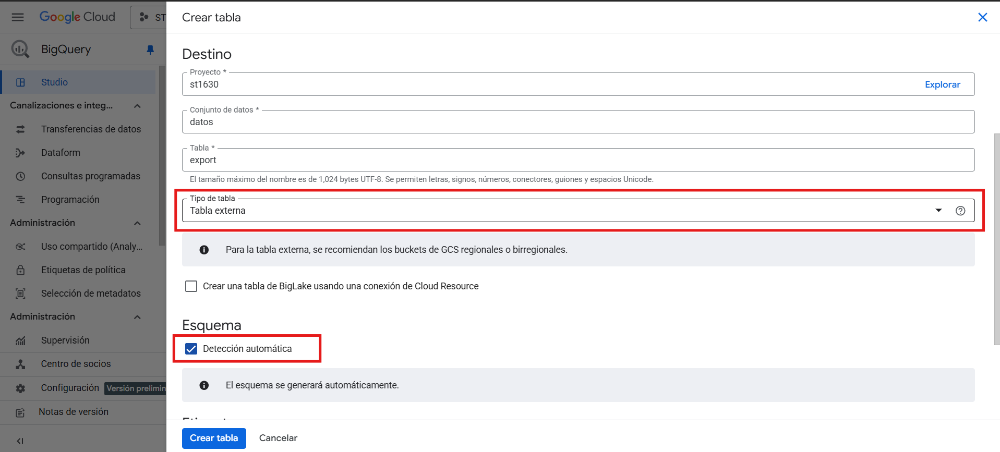
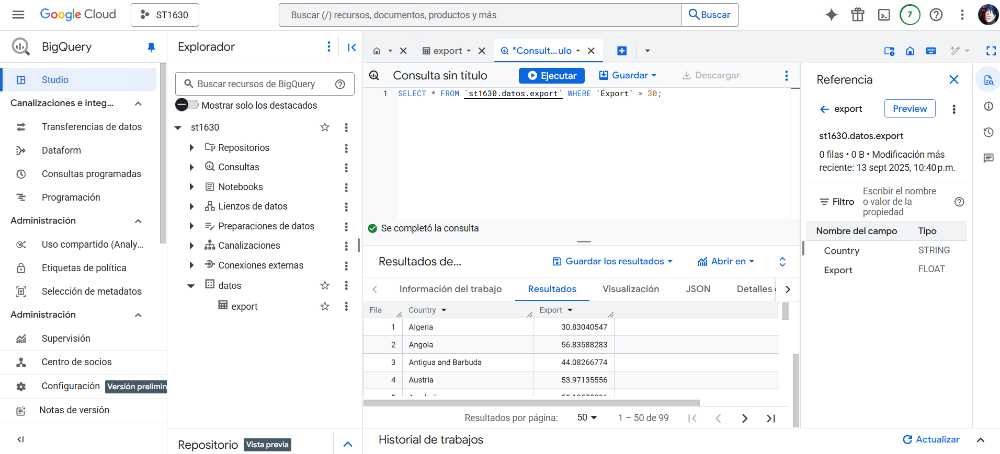

# Daniel Melguizo Roldan
## Sistemas Intensivos de Datos

# 1. Crear Bucket.
Para la creacion del bucket iremos al servicio `Cloud Storage` y daremos clic en la parte superior donde dice `Crear`

Colocaremos un nombre descriptivo, en mi caso `lab1-dmelguizor` y daremos clic sobre el texto que dice: `Elige donde almacenar tus datos`, seleccionaremos Region y agregaremos `us-east1`

Daremos clic en el texto `Elige como controlar el acceso a los objetos` y desactivaremos la opcion de prevencion de acceso publico a este bucket

Dejaremos el resto por defecto y daremos clic en `Crear`

Para cargar los archivos basta con arrastrar nuestros datos desde el administrador de archivos al apartado web o dar clic en la opcion `Subir` dentro del bucket, y elegir si queremos subir una carpeta o un archivo.

# 2. Implementacion de un Data Warehouse sencillo.

Utilizaremos el servicio BigQuery para conectarlo con nuestro bucket.

En el apartado izquierdo, la columna que dice `Explorador` daremos clic sobre los tres puntos y en `Agregar datos`.

Se abrira un nuevo apartado en el que seleccionaremos que nuestra fuente de datos sera `Google Cloud Storage` y seleccionaremos `Carga en BigQuery`

En el nuevo apartado seleccionaremos nuestra fuente de datos dando clic en `Explorar`, aqui eligiremos nuestra fuente de datos teniendo en cuenta que habra que cambiar el formato del archivo en caso de no ser CSV

En el apartado de Destino, seleccionaremos un conjunto de datos en donde queramos que se guarden, si no tenemos ahi mismo podremos crear uno.

En el apartado de tabla, definiremos un nombre para la tabla y definiremos que el tipo de tabla sera `Tabla externa`.

Ademas, activaremos `Deteccion automatica` en el apartado de `Esquema` y daremos en `Crear`.

Se nos creara la tabla con el nombre especificado anteriormente y sobre este ya podremos realizar consultas

